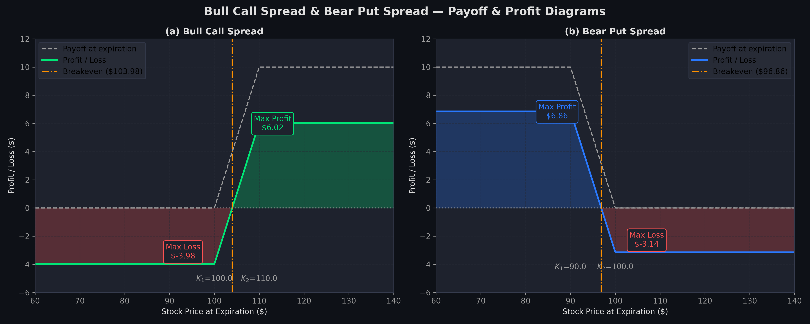
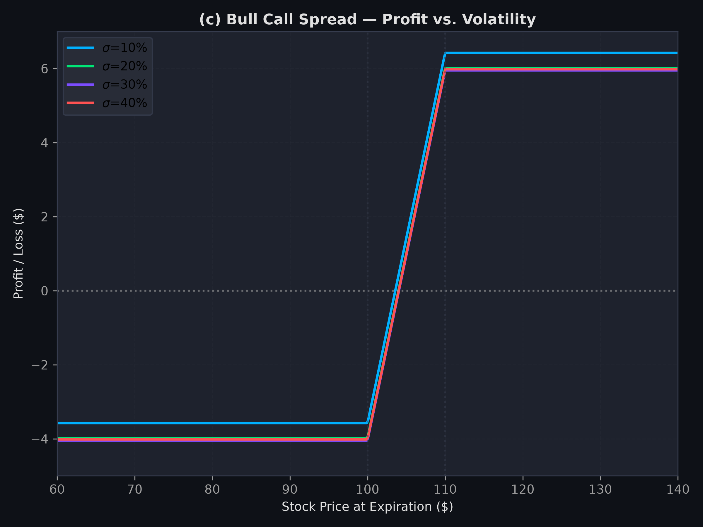
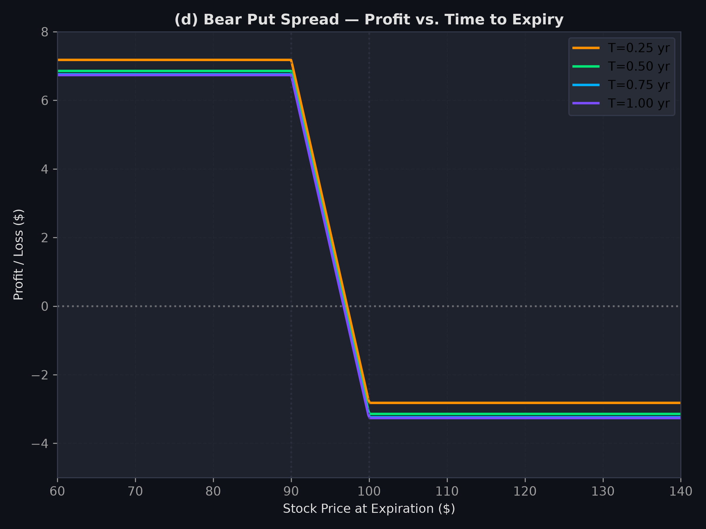
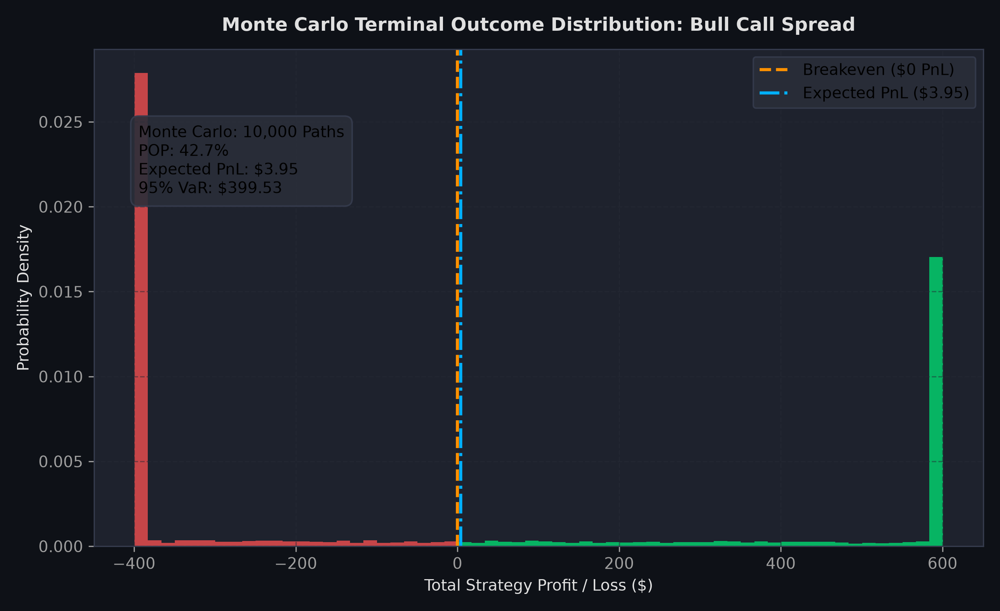

# 📈 Bull and Bear Spread Strategies in Options Markets
### Quantitative Financial Engineering, Black-Scholes-Merton Pricing & Monte Carlo Risk Analytics

[](https://www.python.org/)
[](https://prernasawane.github.io/Bull-and-Bear-Spread-Strategies/)
[](https://streamlit.io/)
[-brightgreen.svg)](tests/)
[](LICENSE)
[](#)

> **Academic Project Reference:** Financial Derivatives Course Project Report (Group 12)  
> **Authors:** Jash Bharat Pasad, Jatin Agarwal, Kalabandi Pramith Joy, Sawane Prerna Bharat, Shrey Agarwal  
> **Live Interactive Web Terminal:** [**https://prernasawane.github.io/Bull-and-Bear-Spread-Strategies/**](https://prernasawane.github.io/Bull-and-Bear-Spread-Strategies/)  
> **Local Standalone Terminal:** Double-click [**`index.html`**](index.html) in any browser (zero dependencies) or run `python -m http.server 8088`!  
> **Python Streamlit Terminal:** Run locally via `streamlit run app.py`

---

## 📌 Executive Summary

This repository houses an institutional-grade quantitative finance framework analyzing two fundamental vertical debit options strategies: the **Bull Call Spread** and the **Bear Put Spread**. Using closed-form **Black-Scholes-Merton (BSM)** equations and **10,000-path Monte Carlo Geometric Brownian Motion (GBM)** simulations, the platform evaluates pricing dynamics, boundary payoff functions, position Greeks, and structural reward-to-risk asymmetry.

### 🌟 Core Discovery: Structural Payout Asymmetry
Under symmetric moneyness distances from the spot price ($S_0 = \$100.00, T = 0.5\text{ yr}, r = 5.0\%, \sigma = 20.0\%$):
- **Bull Call Spread ($K_1=100, K_2=110$):** Net Debit = **\$3.98**, Max Profit = **\$6.02**, Breakeven = **\$103.98**, **Reward-to-Risk = 1.51:1**.
- **Bear Put Spread ($K_1=90, K_2=100$):** Net Debit = **\$3.14**, Max Profit = **\$6.86**, Breakeven = **\$96.86**, **Reward-to-Risk = 2.18:1**.

The Bear Put spread delivers a **+44% superior reward-to-risk ratio** over the Bull Call spread for the same strike width. This asymmetry is mathematically proven to arise from the positive forward drift of the risk-free rate ($S_0 e^{rT}$) and differential time-value decay across the moneyness spectrum.

---

## 🏛️ Repository Architecture

```text
FM_project/
├── .gitignore                         # Standard Python & OS ignore patterns
├── LICENSE                            # MIT Open-Source License
├── README.md                          # Flagship GitHub Presentation
├── requirements.txt                   # Pinned dependency manifest
├── pyproject.toml                     # Modern packaging & test configuration
├── main.py                            # CLI pipeline runner (reproduces Tables & Figures)
├── app.py                             # Interactive Streamlit Trading Terminal & Algorithmic Engine
├── assets/
│   └── figures/                       # 300-DPI Publication-Grade Visualizations
│       ├── figure1_combined_spreads.png         # Payoff & profit curves side-by-side
│       ├── figure1a_bull_call_payoff.png        # Bull Call profit diagram with zones
│       ├── figure1b_bear_put_payoff.png         # Bear Put profit diagram with zones
│       ├── figure2c_bull_volatility_sensitivity.png # Profit vs Implied Volatility (10%-40%)
│       ├── figure2d_bear_maturity_sensitivity.png   # Profit vs Time to Expiration (0.25-1.0 yr)
│       ├── figure3e_monte_carlo_bull.png        # 10k-path GBM distribution (Bull Call)
│       └── figure3e_monte_carlo_bear.png        # 10k-path GBM distribution (Bear Put)
├── data/
│   └── processed/                     # Exported CSV Data Marts
│       ├── table1_bull_call_summary.csv
│       ├── table2_bear_put_summary.csv
│       ├── table3_bsm_option_prices.csv
│       └── table4_side_by_side_comparison.csv
├── docs/
│   ├── RESEARCH_REPORT.md             # Formal Mathematical Derivatives Whitepaper
│   └── INTERVIEW_TALKING_POINTS.md    # Quant Interview Guide (Elevator Pitches, STAR & 10 Q&As)
├── notebooks/
│   └── options_spread_analysis.ipynb  # Interactive Jupyter Notebook walkthrough
├── src/
│   ├── __init__.py
│   ├── config.py                      # Baseline parameters, constants & palette tokens
│   ├── models/
│   │   ├── __init__.py
│   │   └── black_scholes.py           # Closed-form BSM pricing, Greeks & Parity checks
│   ├── strategies/
│   │   ├── __init__.py
│   │   ├── base.py                    # Abstract base strategy interface
│   │   ├── bull_call_spread.py        # Bull Call Spread implementation & metrics
│   │   └── bear_put_spread.py         # Bear Put Spread implementation & metrics
│   ├── simulation/
│   │   ├── __init__.py
│   │   └── monte_carlo.py             # 10,000-path vectorized GBM Monte Carlo engine
│   ├── engine/
│   │   ├── __init__.py
│   │   └── verdict.py                 # Algorithmic trade grading & recommendation engine
│   ├── market_data/
│   │   ├── __init__.py
│   │   └── fetcher.py                 # Live ticker data fetcher with offline resilience
│   └── visualization/
│       ├── __init__.py
│       └── charts.py                  # High-resolution Matplotlib publication charting
└── tests/
    ├── __init__.py
    └── test_spread_engine.py          # Pytest suite validating BSM, Parity & Simulations
```

---

## 🔬 Mathematical Formulations

### 1. Black-Scholes-Merton Analytical Pricing
Under the risk-neutral measure with geometric Brownian motion $dS_t = r S_t dt + \sigma S_t dW_t$:
$$C = S_0 N(d_1) - K e^{-rT} N(d_2)$$
$$P = K e^{-rT} N(-d_2) - S_0 N(-d_1)$$
where:
$$d_1 = \frac{\ln(S_0 / K) + \left(r + \frac{1}{2}\sigma^2\right)T}{\sigma \sqrt{T}}, \quad d_2 = d_1 - \sigma \sqrt{T}$$

### 2. Put-Call Parity Verification
Arbitrage-free valuation enforces:
$$C - P = S_0 - K e^{-rT}$$
At baseline ($S_0 = 100, K = 100, T = 0.5, r = 5\%$):
$$C = \$6.8887, \quad P = \$4.4197 \implies C - P = \$2.4690 \equiv 100 - 100e^{-0.025} = \$2.4690$$

### 3. Expiration Payoffs & Risk Bounds

| Strategy | Construction | Net Debit ($D$) | Expiration Payoff $\Pi(S_T)$ | Max Profit | Max Loss | Breakeven ($S_T^*$) |
| :--- | :--- | :--- | :--- | :--- | :--- | :--- |
| **Bull Call** | Long $K_1$ Call + Short $K_2$ Call | $C_1 - C_2 > 0$ | $\max(S_T - K_1, 0) - \max(S_T - K_2, 0)$ | $(K_2 - K_1) - D_{\text{bull}}$ | $-D_{\text{bull}}$ | $K_1 + D_{\text{bull}}$ |
| **Bear Put** | Long $K_2$ Put + Short $K_1$ Put | $P_2 - P_1 > 0$ | $\max(K_2 - S_T, 0) - \max(K_1 - S_T, 0)$ | $(K_2 - K_1) - D_{\text{bear}}$ | $-D_{\text{bear}}$ | $K_2 - D_{\text{bear}}$ |

---

## 📊 Exact Baseline Reproduction Matrix

The tables below directly replicate the computed values from the course project report:

### Table 3: BSM Option Prices and Net Debits
| Strategy | Leg | Type | Strike | Premium ($) |
| :--- | :--- | :--- | :--- | :--- |
| **Bull Call Spread** | Long | Call | $100 | **6.8887** |
| **Bull Call Spread** | Short | Call | $110 | **2.9065** |
| **Bull Call Spread** | Net | Debit | — | **3.9823** |
| **Bear Put Spread** | Long | Put | $100 | **4.4197** |
| **Bear Put Spread** | Short | Put | $90 | **1.2764** |
| **Bear Put Spread** | Net | Debit | — | **3.1433** |

### Table 4: Side-by-Side Comparison
| Feature | Bull Call Spread | Bear Put Spread |
| :--- | :--- | :--- |
| **Market Outlook** | Moderately bullish | Moderately bearish |
| **Option Types Used** | Two calls | Two puts |
| **Cash Flow at Entry** | Debit | Debit |
| **Net Debit** | **\$3.98** | **\$3.14** |
| **Maximum Profit** | **\$6.02** | **\$6.86** |
| **Maximum Loss** | **-\$3.98** | **-\$3.14** |
| **Breakeven** | **\$103.98** | **\$96.86** |
| **Reward-to-Risk Ratio** | **1.51 : 1** | **2.18 : 1** *(Superior)* |
| **Profit Zone** | $S_T > \$103.98$ | $S_T < \$96.86$ |
| **Theta Effect** | Negative (erodes if flat) | Negative (erodes if flat) |
| **Vega Effect** | Positive (hurts on entry) | Positive (hurts on entry) |

---

## 🖼️ Publication Figures

### 1. Payoff & Profit Diagrams at Expiration (Figure 1)


### 2. Sensitivity Dynamics: Volatility vs. Maturity (Figure 2)
| Bull Call: Profit vs. Volatility ($\sigma \in [10\%, 40\%]$) | Bear Put: Profit vs. Time to Expiration ($T \in [0.25, 1.00]\text{ yr}$) |
| :---: | :---: |
|  |  |

### 3. Monte Carlo PnL Distribution (10,000 Paths) (Figure 3)


---

## 🚀 Quickstart & Execution

### 1. Clone & Install Dependencies
```bash
git clone https://github.com/your-username/bull-bear-spread-analyzer.git
cd bull-bear-spread-analyzer
pip install -r requirements.txt
```

### 2. Run CLI Pipeline Runner
Reproduces all baseline tables, runs the 10k Monte Carlo engine, and exports high-resolution figures:
```bash
python main.py
```

### 3. Run Automated Unit Tests (11 Passed)
```bash
pytest tests/test_spread_engine.py -v
```

### 4. Launch Standalone Web Terminal (Zero-Dependency)
Simply double-click [`index.html`](index.html) in file explorer to open in Chrome, Edge, or Safari, OR run:
```bash
python -m http.server 8088
# Navigate to: http://localhost:8088/index.html
```

### 5. Launch Python Streamlit Terminal
```bash
streamlit run app.py
```

## 📄 License
This project is open-source software licensed under the [MIT License](LICENSE).
